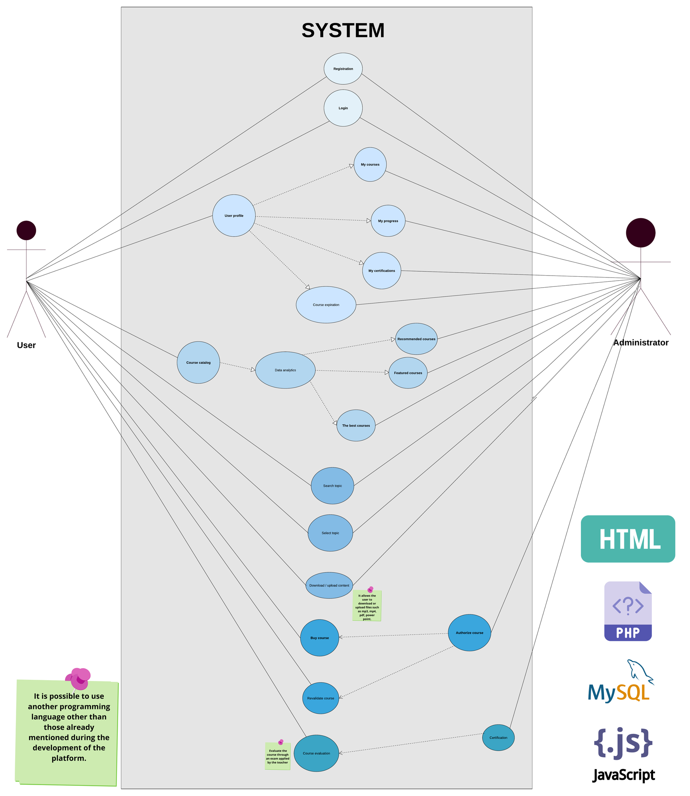
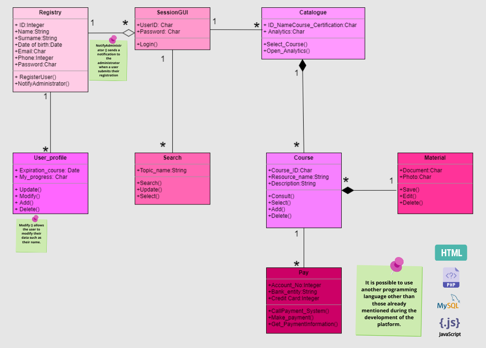
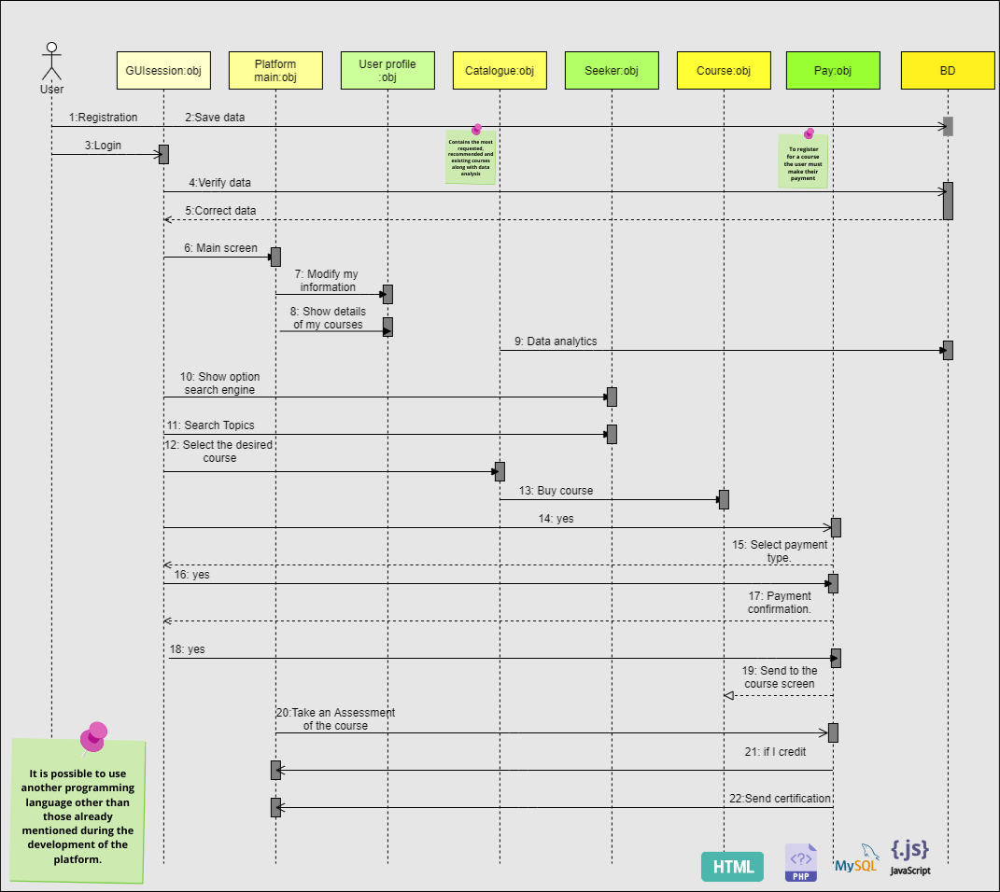
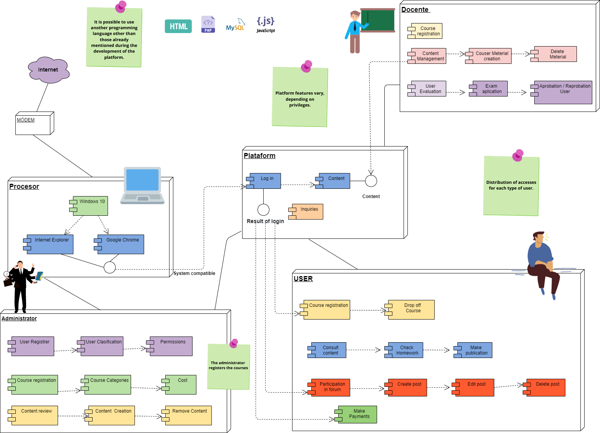

## Introduction.
-----
## 🏆A2.2  Learning Activity.
System architecture documentation based on the 4 + 1 model.

----

## ✏Developing

**Diagrams for each of the views established in the 4 + 1 architecture model.**

- View of the scenarios: Diagram of user cases.

- Logical view: Class diagram.

- Process view: Sequence diagram.

- Developer view: Component diagram.

- Physical view: Distribution diagram.

| **Integrants** | **Conclusion**|
| --- | ---  | 
|Acosta Noriega Saul Eduardo|It was easy to apply the 4 + 1 architecture since it was only adapted because we already had the diagrams made from previous activities, it is for useful to organize the system through functional and non-functional requirements.
|Garza Aguilar Sergio Alberto| The diagrams presented represent the functionality aspects of the system, highlighting the most important aspects of each user. In this document we can see how the functionalities change and it is supported by icons to facilitate readers' knowledge of the technologies used during the development of the system.
|Hernández Fernández Diana|In conclusion, the diagrams that match the views explained in the document provided to us were assigned, some adaptations were also generated where the technologies to be used for the development of the platform
|Zazueta Lopez Diana| When making the diagrams for each of the views of the 4 + 1 architecture model I could see the importance of carrying it out and implementing it in our project of the courses study case and certifications since it describes the system from the point of view from different stakeholders, such as end users, developers or project managers.|

[Go to GitHub 🏠](https://github.com/SergioG93/Analisis-avanzado-de-sofware)