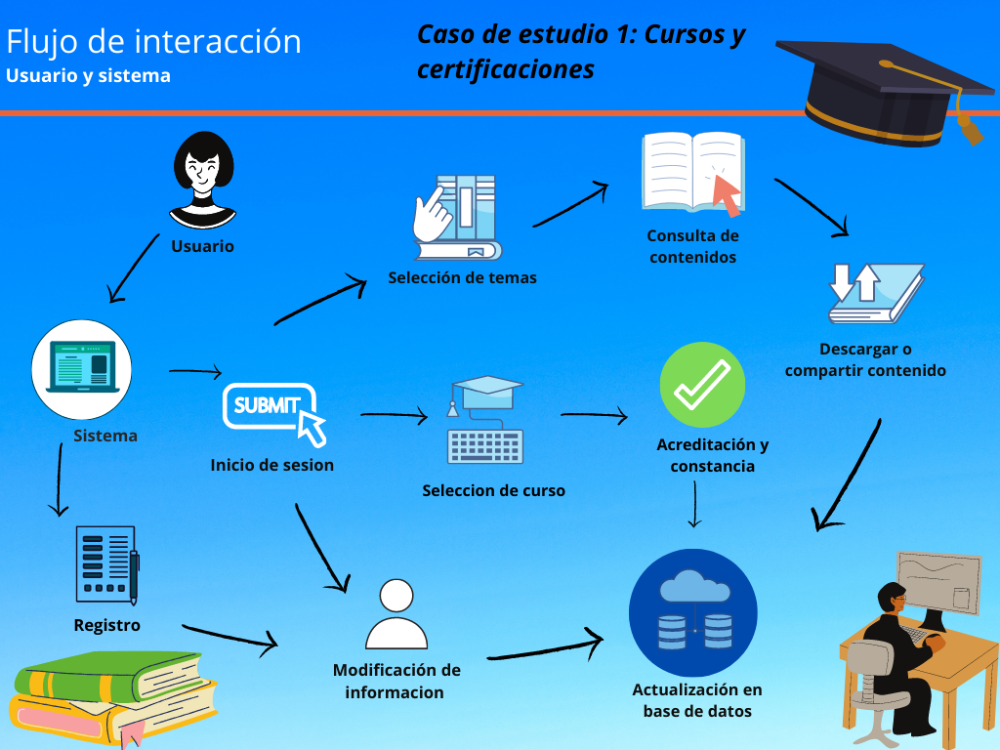

# C0.2 Tipo de sistema de información
## Reto en clase

Investigación sobre el tipo de sistema que involucra el caso de estudio a desarrollar

___
# Caso de estudio

## Introducción al caso de estudio de la empresa “The Vid of Knowledge
### Caso de estudio 1: Cursos y certificaciones
“The vid of knowledge” es una empresa ofrece herramientas tecnologías basadas en la administración y conservación del conocimiento, sin embargo debido a la gran competitividad del mercado y a las condiciones actuales y cambiantes, esta considerando proveer una aplicación referente a “cursos y certificaciones” por medio de una plataforma en línea, a un nivel de calidad y costo que le permita obtener mayores ganancias. A través de un estudio de mercado sobre otras plataformas similares, se observa que entre las características que se debe ofrecer dentro de este modelo de negocio están los siguientes:

* Ofrecer a los usuarios una plataforma que este disponible en todo momento, que sea fácil de utilizar y atractiva, así como garantice seguridad de la información que ahí se registre .
* Ofrecer a los usuarios inscribirse a un cualquier curso a través de un catalogo, y/o un mapa de ruta de cursos basado en un perfil establecido.
Permitir que los cursos que se publiquen y ofrezcan puedan ser creados utilizando distintos formatos tales como son videos o presentaciones, y separadas por tópicos con un limite máximo de tamaño y duración.
* Ofrecer al usuario los avances logrados por cada curso, y al ser completado a través de una evaluación exitosa, otorgue un comprobando de certificación.
* Ofrecer analítica de datos sobre los cursos que son mas solicitados, los cursos a los cuales los usuarios se enrolaron y completaron, así como los usuarios a los cuales su certificación esta por expirar o expiro.
___ 
 # Tipo de sistema a seleccionado
## Sistema de administración del conocimiento
KMS Knowledge Managment Systems

### Objetivo
* Este permite administrar los procesos para capturar y aplicar el conocimiento y la experiencia.

## Justificación

Un sistema de administración de conocimiento sirve como una herramienta para poder administrar y compartir información, basado en la explicacion de los requerimientos de este caso de estudio en el cual se solicita una plataforma para realizar cursos y certificaciones que hará acreedores a los usuarios de una constancia existe mucha similitud de las características con el tipo de sistema KMS.
 
## Requerimientos del sistema
 
La creación de una plataforma que está disponible en todo momento y sirva como una herramienta de apoyo para acceder y compartir conocimiento es la base para trabajar pero para que esta pueda ser un sistema de administración del conocimiento es necesario que cumpla con las siguientes características:
 
* Identificar conocimiento
* Crear conocimiento
* Seleccionar conocimiento
* Organizar conocimiento
* Almacenar conocimiento
* Filtrar conocimiento
* Compartir conocimiento
* Usar conocimiento

Los usuarios deben de tener una experiencia grata al utilizar la plataforma por medio de una interfaz sencilla en la que puedan compartir artículos y que otros usuarios puedan hacer aportación por medio de comentarios acerca del tema que se presenta, en el caso de las actividades propuestas para la acreditación de los cursos como comunidad se puede brindar apoyo excepto en las evaluaciones.
Los datos serán capturados por la plataforma al momento del registro y estos serán guardados en su perfil donde podrán ser modificados posteriormente si así lo necesita, esta información únicamente puede ser vista y modificada por el usuario y serán utilizados para darse de alta en los cursos y posteriormente en su certificación.
 
##  Diagrama de la interacción de un usuario con el sistema.

## :memo: [Volver a inicio](https://github.com/SergioG93/Analisis-avanzado-de-sofware)	