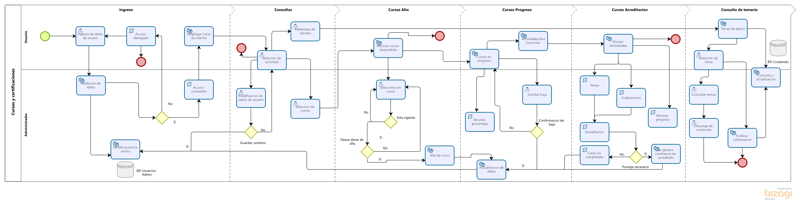

# Inicio del proyecto

## :trophy: C1.1 Reto en clase

Definición de Objetivo general y los especificos, asi como el modelado del negocio.

### :blue_book: Instrucciones

- De acuerdo con la información presentada por el asesor referente al tema, y basado en el caso de estudio indicado responder los puntos indicadas en el desarrollo de la actividad, redactando el objetivo general y sus objetivos especificos.
- Elabore el modelado del negocio del caso de estudio, utilizando una herramienta CASE, se propone el uso de [bizagi Modeler](https://www.bizagi.com/plataforma/modeler) o drawio.io.
- Toda actividad o reto se deberá realizar utilizando el estilo **MarkDown con extension .md** y el entorno de desarrollo VSCode, debiendo ser elaborado como un documento **single page**, es decir si el documento cuanta con imágenes, enlaces o cualquier documento externo debe ser accedido desde etiquetas y enlaces.
- Es requisito que el archivo .md contenga una etiqueta del enlace al repositorio de su documento en Github, por ejemplo **Enlace a mi GitHub**
- Al concluir el reto el reto se deberá subir a github el archivo .md creado.
- Desde el archivo **.md** se debe exportar un archivo **.pdf** con la nomenclatura **C1.1_NombredelaActividad_NombreAlumno.pdf**, el cual deberá subirse a classroom dentro de su apartado correspondiente, para que sirva como evidencia de su entrega; siendo esta plataforma **oficial** aquí se recibirá la calificación de su actividad por individual.
- Considerando que el archivo .pdf, fue obtenido desde archivo .md, ambos deben ser idénticos y mostrar el mismo contenido.
- Su repositorio ademas de que debe contar con un archivo **readme**.md dentro de su directorio raíz, con la información como datos del estudiante, equipo de trabajo, materia, carrera, datos del asesor, e incluso logotipo o imágenes, debe tener un apartado de contenidos o indice, los cuales realmente son ligas o **enlaces a sus documentos .md**, _evite utilizar texto_ para indicar enlaces internos o externo.
- Se propone una estructura tal como esta indicada abajo, sin embargo puede utilizarse cualquier otra que le apoye para organizar su repositorio.

```
| readme.md
| | blog
| | | Cx.1_NombredelaActividad.md
| | | Ax.1_NombredelaActividad.md
| | diagrams
| | docs
| | html
| | img
| | pdf    
```


## :pencil2: Desarrollo

___

1. Especifique el  **Objetivo general** del caso de estudio, recordándose que se debe indicar lo que se busca con el proyecto.
2. Especifique tres **objetivos específicos**, recordándose que deben ser medibles, cuantificables y logrables.
3. Elabore el diagrama del **modelo del negocio** que se visualiza para el caso de estudio, utilizando BPMN y la herramienta case Bizagi.

___

### :bomb: Rubrica


| Criterios     | Descripción                                                                                  | Puntaje |
| ------------- | -------------------------------------------------------------------------------------------- | ------- |
| Instrucciones | Se cumple con cada uno de los puntos indicados dentro del apartado Instrucciones?            | 20 |
| Desarrollo    | Se respondió a cada uno de los puntos solicitados dentro del desarrollo de la actividad?     | 80      |


___

# Objetivo General
Implementar una plataforma web compatible con diferentes dispositivos ya que debera ppermitir el acceso en cualquier locacion, que permita a sus usuarios obtener, conservar y compartir conocimiento por medio de cursos en diversos temas que logren capacitar generando competencias y se les genere una certificación que los avale.
## Objetivos específicos
* Capacitar y acreditar al menos al 70% de los usuarios que se registren a los cursos brindando actualización y seguimiento a los usuarios inscritos con sus progresos. 
* Crear una base de datos solida de temas de interés que se esté actualizando diariamente un tema por los usuarios y administradores activos.
* Aumentar el flujo de visitas de la plataforma a 100 vistas quincenales durante los próximos tres meses con la expectativa de generar un 15% de aumento de usuarios interesados en la certificación y aporte de conocimiento.
___

# Modelo de negocios



### - [Revisar actividad en GIT](https://github.com/SergioG93/Analisis-avanzado-de-sofware/blob/main/Blogs/C1.1%20Definici%C3%B3n%20de%20Objetivo%20general%20y%20los%20especificos%2C%20asi%20como%20el%20modelado%20del%20negocio.md)
## :memo: [Volver a inicio](https://github.com/SergioG93/Analisis-avanzado-de-sofware)	
