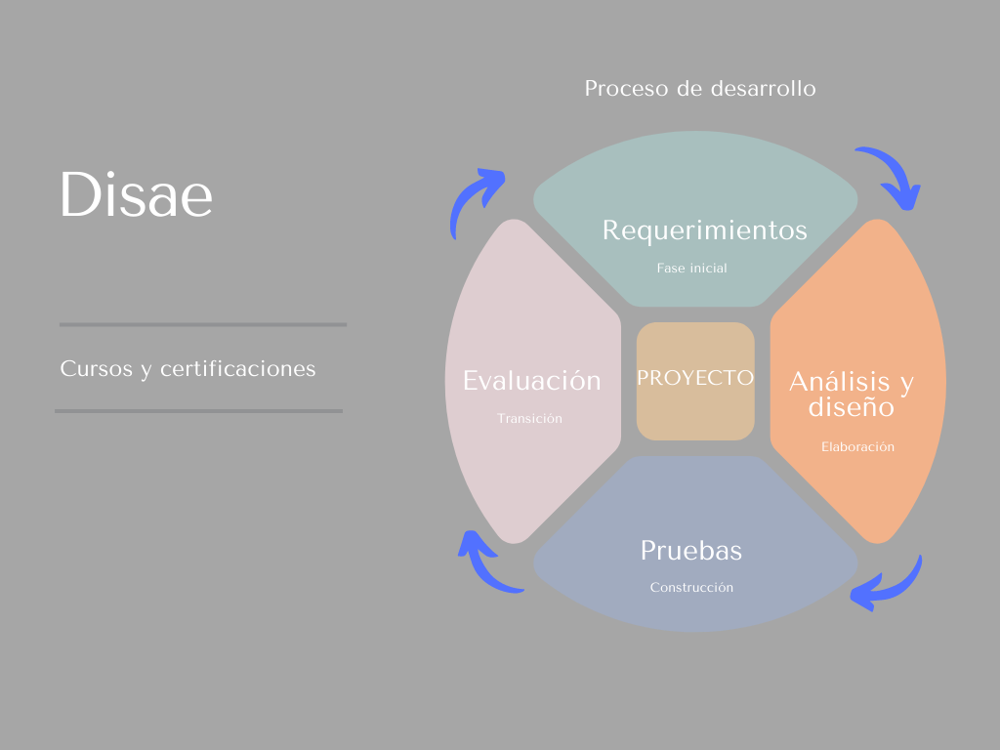

# Inicio del proyecto

## :trophy: C1.2 Reto en clase

Elaboracion del acta constitutiva del proyecto

### :blue_book: Instrucciones

- De acuerdo con la información presentada por el asesor referente al tema, y basado en el caso de estudio, realizar el acta constitutiva del proyecto basado en el ejemplo [documento acta constitución del proyecto](../pdf/C1.2_Ejemplo_ActaConstitución_delProyecto.pdf) indicada por el asesor
- Toda actividad o reto se deberá realizar utilizando el estilo **MarkDown con extension .md** y el entorno de desarrollo VSCode, debiendo ser elaborado como un documento **single page**, es decir si el documento cuanta con imágenes, enlaces o cualquier documento externo debe ser accedido desde etiquetas y enlaces.
- Es requisito que el archivo .md contenga una etiqueta del enlace al repositorio de su documento en Github, por ejemplo **Enlace a mi GitHub**
- Al concluir el reto el reto se deberá subir a github el archivo .md creado.
- Desde el archivo **.md** se debe exportar un archivo **.pdf** con la nomenclatura **C1.2_NombredelaActividad_NombreAlumno.pdf**, el cual deberá subirse a classroom dentro de su apartado correspondiente, para que sirva como evidencia de su entrega; siendo esta plataforma **oficial** aquí se recibirá la calificación de su actividad por individual.
- Considerando que el archivo .pdf, fue obtenido desde archivo .md, ambos deben ser idénticos y mostrar el mismo contenido.
- Su repositorio ademas de que debe contar con un archivo **readme**.md dentro de su directorio raíz, con la información como datos del estudiante, equipo de trabajo, materia, carrera, datos del asesor, e incluso logotipo o imágenes, debe tener un apartado de contenidos o indice, los cuales realmente son ligas o **enlaces a sus documentos .md**, _evite utilizar texto_ para indicar enlaces internos o externo.
- Se propone una estructura tal como esta indicada abajo, sin embargo puede utilizarse cualquier otra que le apoye para organizar su repositorio.

```
| readme.md
| | blog
| | | Cx.1_NombredelaActividad.md
| | | Ax.1_NombredelaActividad.md
| | diagrams
| | docs
| | html
| | img
| | pdf    
```
___

## :pencil2: Desarrollo

1. Elabore el documento que se anexa en las instrucciones referente al acta constitutiva al estilo markdown, dentro del entorno de visual studio code.
2. Redacte el acta constitutiva elaborada y registrada con los datos solicitados.

___

## Acta constitutiva de proyecto


|Empresa:|Disae|
| ----------- | ----------- |
|**Nombre del proyecto:**|Caso 1: Cursos y certificaciones|
|**Tipo de proyecto:**|Educacion, academico|
|**Patrocinador:**|Saul Acosta Noriega|
|**Dueño del producto:**|Diana Zazueta Lopez|
|**Gerente del proyecto:**|Diana Hernandez Fernandez|
|**Scrum Master:**|Sergio Garza Aguilar|

|Propósito del documento|
| ----------- |
|Documento en el cual serán explicados los objetivos y alcances del proyecto, así como las metodologías que se utilizaran con el fin de indagar mostrar los puntos que deben ser cubiertos en la organización para un resultado óptimo por medio de la aplicación tiempos y la utilización de recursos.|

|Propósito/Justificación |
| ----------- |
|Ya sea dirigido por una empresa o que un usuario busque adquirir nuevos conocimientos de una forma práctica al mismo tiempo que puede reforzar esos conocimientos en conjunto con otros usuarios mejorando la experiencia de un curso disponible, se busca capacitar un gran número de usuarios ofreciendo un amplio catálogo de cursos que generaran personas capacitadas en diferentes ámbitos con un flujo creciente de usuarios que aportaran convirtiendo la plataforma en una importante herramienta para la adquisición de conocimientos. |

|Breve descripción del proyecto |
| ----------- |
|En una plataforma web a la que se podrá acceder a en cualquier momento, se pondrán a disposición diferentes cursos, al concluir de una manera satisfactoria recibirá una certificación oficial que hace constar el trabajo y dedicación brindando una sensación de éxito. Mientras un usuario este dentro de la plataforma podrá realizar consultas en materiales de estudio y compartir con los demás ideas y dudas. |

|Alcance preliminar |
| ----------- |
|El proyecto ofrecerá diferentes cursos por lo que el usuario podrá seleccionarlos para inscribirse, una ves este haya entrado a él se pondrá a disposición un foro para compartir ideas así como el material necesario para sus sesiones de estudio, tareas y evaluaciones. |

|Resultados esperados del proyecto|
| ----------- | 
- Crecer en cantidad de usuarios
- Ampliar el catálogo de cursos
- Mantener un alto nivel de conocimiento de sus usuarios.
- Plataforma con acceso en todo momento
- Cursos diversos en constante actualización
- Comunidad activa que se apoya durante el estudio
- Actualización de progreso y evaluaciones
- Acceso a múltiples materiales de apoyo
- Clases multimedia que pueden ser consultadas en cualquier momento
- Constancia que acredita la realización de un curso


### Requisitos de alto nivel del proyecto 
| Requisito | Criterio de Éxito |
| --- | --- | 
|El usuario podrá generar un registro en la plataforma, ingresando los datos solicitados por la misma y una vez hecho tendrá acceso a ella.|Se agregará el usuario a la base de datos y se le concederá el acceso.
|En la plataforma él los usuarios podrán tener acceso a diferentes materiales de apoyo que les brindarán las herramientas necesarias en la obtención de conocimientos para completar sus cursos.|Se podrán realizar las diferentes consultas en base a la necesidad.|
Al estar inscrito en un curso, el usuario podrá validar su progreso y al ser completa deberá de obtener una constancia que lo acredite por la finalización satisfactoria de este.|La plataforma mostrara el avance y brindara una constancia al finalizar un curso.|

|Hitos |



|Riesgos |
| ----------- |
|No cumplir con los requerimientos
Entregas fuera de tiempo
Conexión con base de datos inestable
Falta de comunicación
Fallas de sistema 
Baja calidad en los entregables
 

 **Interesados en el proyecto** 
|Interesado |Cargo |Rol |Teléfono |Email|
|--- |--- |--- |--- |---|
|Zazueta Lopez Diana|Jefa |Desarrollador-Diseñador|664-773-3045|diana.zazueta18@tectijuana.edu.mx|
|Hernandez Fernandez Diana|Gerente |Documentador-Analista|664-306-1394|diana.hernandez18@tectijuana.edu.mx|
|Garza Aguilar Sergio Alberto|Scrum master|Desarrollador-Diseñador|664-123-5432|sergio.garza@tectijuana.edu.mx|
|Acosta Noriega Saul Eduardo| Patrocinador |Documentador-Analista|664-987-2546|saul.acosta16@tectijuana.edu.mx|

## Costos
Conceptos por trabajo de desarrolo del software en plazos mensuales hasta la finalizacion del proyecto efectuando al mmomento de la entrega un ultimo pago de $ 20,000 (pesos).
| Concepto | Costo/Pesos |
| --- | --- | 
|Rentas|$ 7000
|Equipo|$ 5000|
Personal|$ 65000|
Total| $ 77000

|Supuestos |
| ----------- |
|La empresa cuenta con personal para la administración de la plataforma al ser entregada.
Los usuarios cuentan con un conocimiento previo en uso de dispositivos móviles.
Cursos que serán propiedad de la empresa y serán administrados por ella.
El contenido de la plataforma será responsabilidad de la administración.


|Restricciones  |
| ----------- |
|Fecha de entre máxima del proyecto 31 Julio 2021
Se entregarán únicamente los requerimientos solicitados por el cliente y propuestos en este documento, cualquier función adicional será tratable lo que se tendrán que realizar modificaciones.
Disae no tendrá responsabilidad por la administración del contenido o usuarios de la plataforma.

|Autorización de proyecto||||
|---|---|---|---|
|**Nombre**|**Cargo**|**Firma**|**Fecha**|
|Jaime Leonardo Enriquez Alvarez|Patrocinador|____________|06/abril/2021|


## :memo: [Volver a inicio](https://github.com/SergioG93/Analisis-avanzado-de-sofware)	
